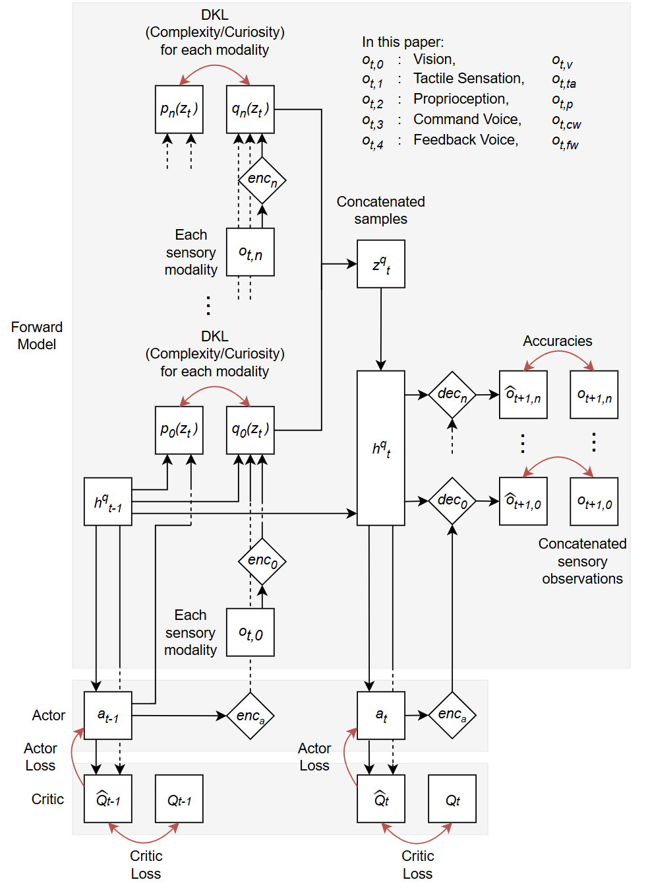

# general_FEP_RL
This package provides a configurable, customizable Reinforcement Learning (RL) architecture implementing the Free Energy Principle (FEP).



This is based on these papers:

Intrinsic Rewards for Exploration without Harm from Observational Noise: A Simulation Study Based on the Free Energy Principle
https://arxiv.org/abs/2405.07473

Curiosity-Driven Development of Action and Language in Robots Through Self-Exploration
https://arxiv.org/abs/2510.05013

The agent learns a probabilistic world model (AKA forward model) implemented as a recurrent neural network (RNN).
This model minimizes Free Energy by maintaining prior and posterior latent states and predicting future observations. 

```math 
F_t = \underbrace{D_{KL}[q(z_t)||p(z_t)]}_{\text{Complexity}} - \underbrace{\mathbb{E}_{q(z_t)}[\log p(o_{t+1}|z_t)]}_{\text{Accuracy}}.
```

The hidden states are used as inputs for a Soft Actor Critic (SAC). 
The critic predicts a Q-value consisting of extrinsic rewards, entropy, curiosity, and imitation. 
The actor samples an action which maximizes predicted Q-value and entropy. This minimizes Expected Free Energy.

```math 
Q_t &= r_t + \eta D_{KL}[q(z_{t}|o_{t},h_{t-1})||p(z_{t}|h_{t-1})] + \alpha \mathcal{H}(\pi_{\phi} (a_{t+1} | h_{t})) \\ 
+ &\gamma (1 - done_t) \mathbb{E}_{o_{t+1} \sim D, a_{t+1} \sim \pi_\phi} [Q_{\bar{\theta}}(o_{t+1}, a_{t+1})].
```

Combined, the World Model and SAC are somewhat adversarial. 
The World Model tries to avoid surprise by understanding the relationship between observations, actions, and the environment. 
The SAC seeks states and actions that yield both expected reward and information gain, forcing the world model to adapt to novel and surprising experiences.

To use this package for any RL setup, provide an encoder and decoder for each module of observation and action. These models require these variables:

Encoder requirements:
    example_input
    example_output
    arg_dict:
        encode_size
        zp_zq_sizes

    This returns one value: the encoding of the input.

Decoder requirements:
    example_input
    example_output
    loss_func

    This returns two values: the generated output and log-probabilities of those outputs.